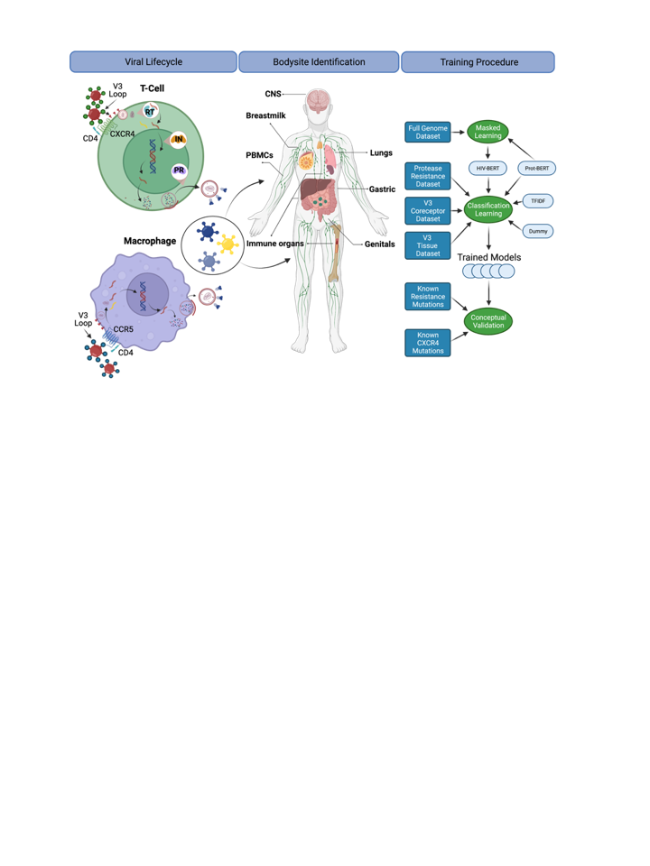
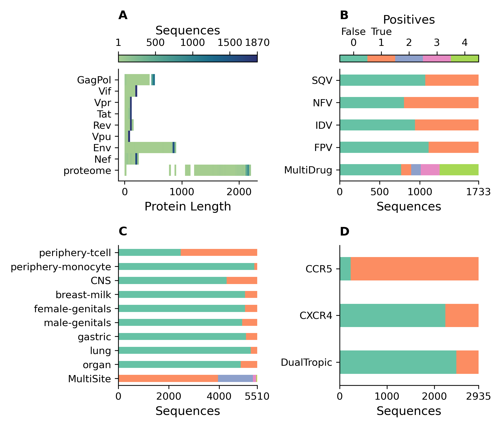
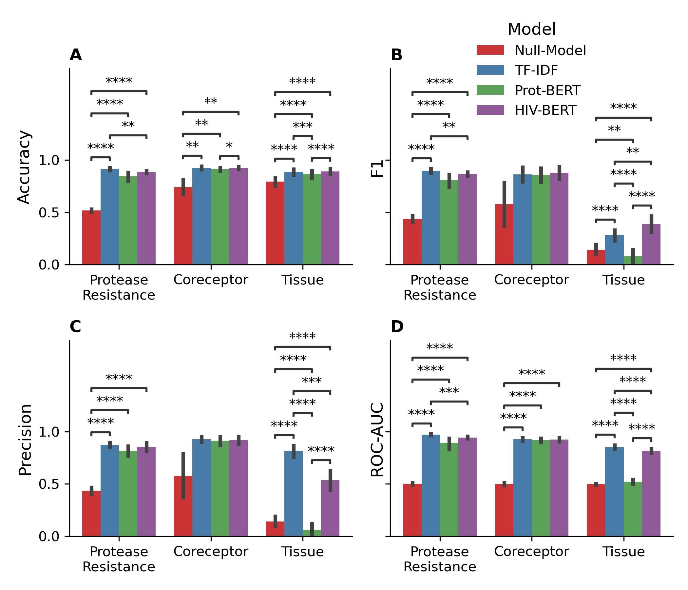
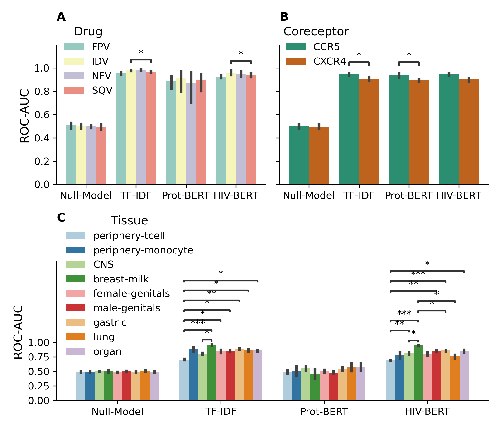
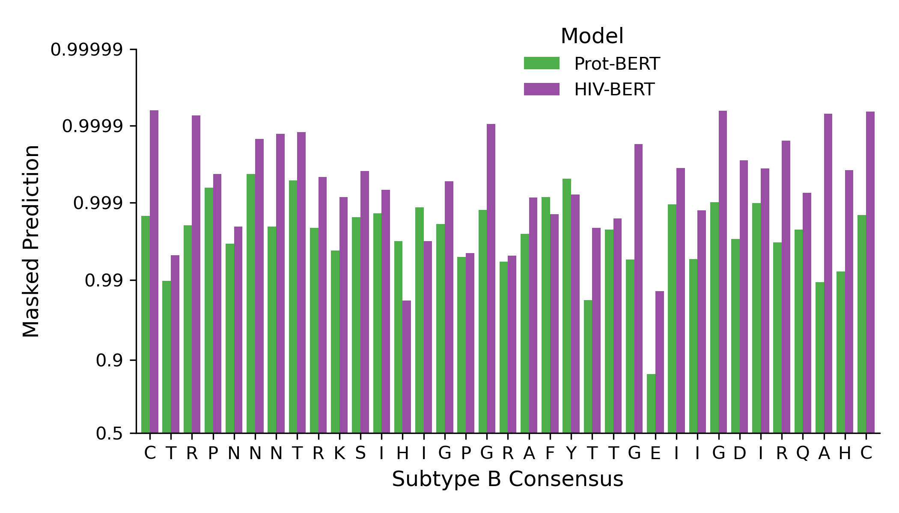
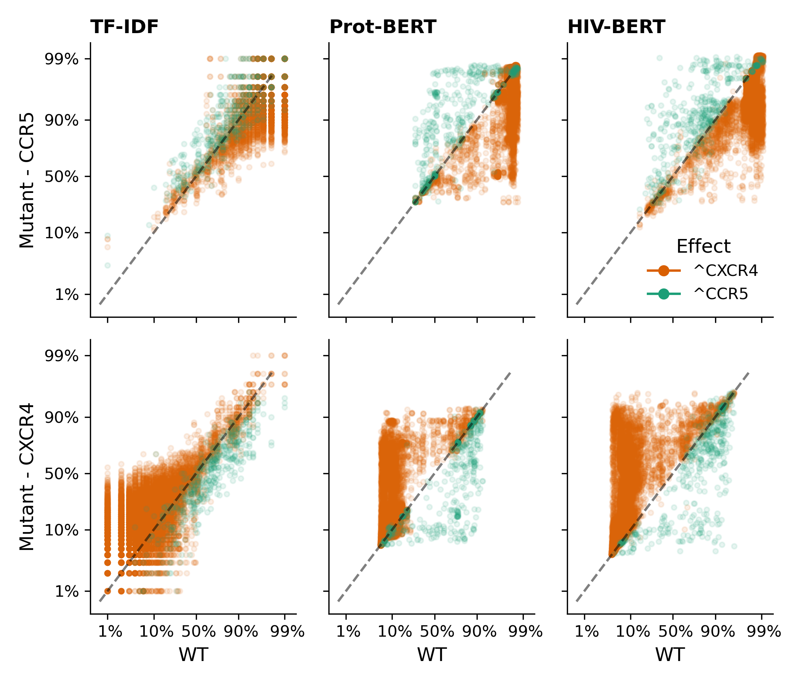
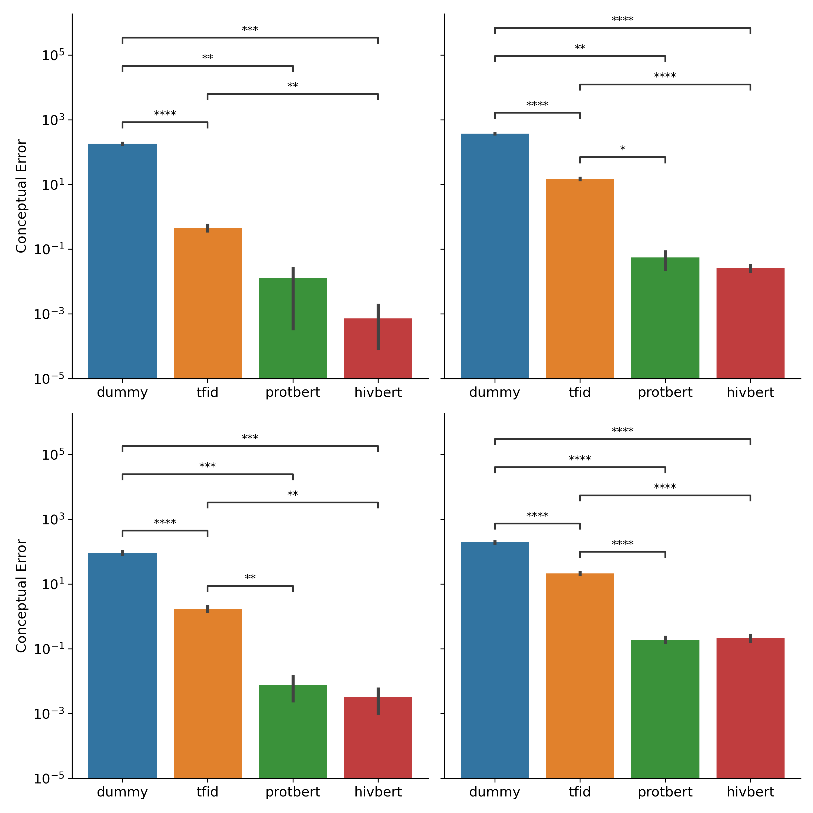
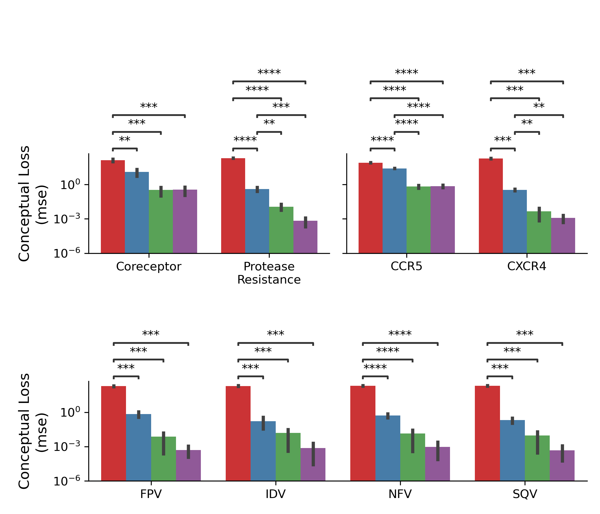

# HIV-Transformers

A repository containing the training scripts and evaluation experiments for the paper: 
_HIV-Bidirectional Encoder Representations from Transformers (BERT): a set of pretrained transformers for accelerating HIV deep learning tasks._
Frontiers in Virology. 2022


## Abstract 

The human immunodeficiency virus type 1 (HIV-1) is a global health threat that is characterized by extensive genetic diversity both within and between patients, rapid mutation to evade immune controls and antiretroviral therapies, and latent cellular and tissue reservoirs that stymie cure efforts.
Viral genomic sequencing has proven effective at surveilling these phenotypes. 
However, rapid, accurate, and explainable prediction techniques lag our sequencing ability. 
Modern natural language processing libraries, like the Hugging Face transformers library, have both advanced the technical field and brought much-needed standardization of prediction tasks. 
In this project, the application of this toolset to an array of classification tasks useful to HIV-1 biology was explored: protease inhibitor resistance, coreceptor utilization, and body-site identification. 
HIV- Bidirectional Encoder Representations from Transformers (BERT), a protein-based transformer model fine-tuned on HIV-1 genomic sequences was able to achieve accuracies of 88%, 92%, and 89% on the tasks respectively making it competitive with leading models capable of only one of these tasks. 
This model was also evaluated using a data augmentation strategy when mutations of known function were introduced. 
The HIV-BERT model produced results that agreed in directionality 10- to 1000-fold better than traditional machine learning models, indicating an improved ability to generalize biological knowledge to unseen sequences. 
The HIV-BERT model, trained task-specific models, and the datasets used to construct them have been released to the Hugging Face repository to accelerate research in this field. 

## Utilizing

The new datasets and trained models resulting from this study have been uploaded to the Huggingface repository.

### Datasets

The datasets have been uploaded to the following repositories:
 
 - https://huggingface.co/datasets/damlab/HIV_FLT
 - https://huggingface.co/datasets/damlab/HIV_V3_coreceptor
 - https://huggingface.co/datasets/damlab/HIV_V3_bodysite
 - https://huggingface.co/datasets/damlab/HIV_PI
 
Model cards have been created in order to orient the reader to the appropriate fields and considerations.

These datasets can be loaded into a python environment like so:

```python
import datasets

data = datasets.load_dataset('damlab/HIV_FLT')
```
 
### Models
 
The trained models were uploaded to:
 - https://huggingface.co/damlab/HIV_BERT
 - https://huggingface.co/damlab/HIV_V3_bodysite
 - https://huggingface.co/damlab/HIV_PR_resist
 - https://huggingface.co/damlab/HIV_V3_Coreceptor
 
Model cards have been created in order to orient the reader to the appropriate input usage, training procedures, and evaluation results. 

These models can be loaded into a python environment like so:

```python
from transformers import pipeline

predictor = pipeline("text-classification", model="damlab/HIV_V3_bodysite")
predictor(f"C T R P N N N T R K S I R I Q R G P G R A F V T I G K I G N M R Q A H C")

[
  [
    {
      "label": "periphery-tcell",
      "score": 0.29097115993499756
    },
    {
      "label": "periphery-monocyte",
      "score": 0.014322502538561821
    },
    {
      "label": "CNS",
      "score": 0.06870711594820023
    },
    {
      "label": "breast-milk",
      "score": 0.002785981632769108
    },
    {
      "label": "female-genitals",
      "score": 0.024997007101774216
    },
    {
      "label": "male-genitals",
      "score": 0.01040483545511961
    },
    {
      "label": "gastric",
      "score": 0.06872137635946274
    },
    {
      "label": "lung",
      "score": 0.04432062804698944
    },
    {
      "label": "organ",
      "score": 0.47476938366889954
    }
  ]
]
```


## Running

This toolset is capable of recreating all experiments described in the manuscript from a single `snakemake` call.

```bash
conda create -c conda-forge -c bioconda --name hiv-transformers snakemake-minimal
conda activate hiv-transformers

git clone git@github.com:DamLabResources/hiv-transformers.git
cd hiv-transformers

snakemake --use-conda --cores all
```

This will download the relevant libraries and run the relevant experiments.

## Results

The final figures are included in the `figures/` directory.

### Figure 1
A diagram for the biological processes explored.
The left column depicts the basic viral lifecycle starting with entry through the binding of CD4 and cell-specific coreceptors, followed by unpackaging of the capsid, reverse transcription of viral RNA, integration into the host genome, subsequent translation of viral proteins and repackaging. 
Steps where of antiretroviral medications interfere with the lifecycle are also noted. 
The middle panel indicates bodysites that are known to be anatomic reservoirs of latent viral replication. 
The right panel shows a flow diagram of the experiments and training procedures described in the text. 
Figure created with BioRender.com 

.


### Figure 2
Description of publicly released datasets. 
**(A)** The length of each translated sequence is shown as a heatmap with darker regions indicating a greater concentration of sequences at that length.
The proteome represents the total length of all translated sequences.
**(B)** The number of protease sequences with observed resistance (orange) and no resistance (green) to each of four drugs.
MultiDrug resistance represents the sum of individual drug resistances and is indicated by the key above.
**(C)** The number of V3 sequences observed at each body-site (orange) and not observed (green) to each of the grouped sites. MultiSite represents the total number of sites that a unique V3 sequence was observed in.
**(D)** The number of V3 sequences annotated with known coreceptor usage with those able to bind the coreceptor in orange and those not able to bind the coreceptor in green. DualTropic represents sequences that were determined to utilize both coreceptors in orange and those only able to bind to one are shown in green.  
. 


### Figure 3
Pretraining improves prediction metrics across all tasks. 
The accuracy **(A)**, F1-score **(B)**, precision **(C)**, and AUC **(D)** are shown for each model and each prediction task. 
The bar indicates the mean value and the error bars represent the 95% confidence interval of 5-fold cross validation. 
The Null model is shown in red, the TF-IDF model is show in blue, the Prot-BERT model in green, and the HIV-BERT model is in purple. 
The test-comparison bars represent the results of a paired t-test between each group; undrawn comparisons p<0.05, \*(0.05<p<=0.01), \*\*(0.01<p<=0.001), \*\*\*(0.001<p<=0.0001), \*\*\*\*(p<=0.00001). A Bonferroni correction based on all possible tests in the figure. 

 

### Figure 4
Area under the curve (AUC) scores for individual fields of drug resistance and coreceptor prediction are consistent, but tissue identification is not. 
The model AUC scores were disambiguated for each field of each prediction task. Each task is shown in **(A)** protease drug resistance, **(B)** coreceptor prediction, and **(C)** tissue isolation with colors indicating the prediction field. 
The bar indicates the mean value and the error bars represent the 95% confidence interval of 5-fold cross validation. 
The test-comparison bars represent the results of a paired t-test between each group; undrawn comparisons p<0.05, \*(0.05<p<=0.01), \*\*(0.01<p<=0.001), \*\*\*(0.001<p<=0.0001), \*\*\*\*(p<=0.00001). A Bonferroni correction based on all possible tests in the figure. 

 

### Figure 5

Full genome pretraining of the Prot-BERT model increases HIV-1 sequence awareness. 
The probability of each consensus amino acid of the V3 loop when performing masked prediction task. 
Green bars represent the prediction from the Prot-BERT model and red bars represent the HIV-BERT model.  

 

### Figure 6

Transformer models accurately predict the outcome of drug resistance mutations (DRMs). 
Each sequence in the resistance dataset was mutated by each of the ten DRMs as described in the methods and each mutated sequence is shown as a single point; there are ten points per sequence. 
Sequences where a DRM was added are shown in red which should increase the probability of resistance. 
Points in grey indicate sequences where a DRM was removed and should decrease in probability of resistance. 
The dashed black line shows the x=y line and the assumption of no change due to the mutation. 
Each column of axes shows the predictions using each of the three models. 
With the first column indicating the TF-IDF model; the second indicating the Prot-BERT model; and the third showing the HIV-BERT results. 
Each row represents the prediction on a different drug in the order FPV, IDV, NFV, and SQV.  

 

### Figure 7

Transformer models accurately predict the outcome of CXCR4 enhancing mutations.
Each sequence in the V3 coreceptor dataset was mutated by each of the nine CXCR4 promoting mutations as described in the methods and each mutated sequence is shown as a single point; there are nine points per sequence.
Sequences where a CXCR4 promoting mutation was added is shown in orange which should increase the probability of CXCR4 binding and decrease the probability of CCR5 binding. 
Points in green indicate sequences where a CXCR4 promoting mutation was removed and should decrease CXCR4 binding and increase CCR5 binding. 
The dashed black line shows the x=y line and the assumption of no change due to the mutation. 
Each column of axes shows the predictions using each of the three models with the first column indicating the TF-IDF model; the second indicating the Prot-BERT model; and the third showing the HIV-BERT.
Each row represents the prediction on a different coreceptor with CCR5 on the top and CXCR4 on the bottom.

 

### Figure 8

HIV-1 pretraining decreases conceptual error. 
**(A)** The average conceptual error of each model is shown in across the coreceptor and protease resistance tasks for each model. 
**(B)** The conceptual error was disambiguated across each field of the coreceptor model. 
**(C)** The conceptual error was disambiguated across each field of the protease resistance model. 
Across all axes the Null model is show in red, the TF-IDF model is show in blue, the Prot-BERT model in green and the HIV-BERT model is in purple. 
The test-comparison bars represent the results of a paired t-test between each group; undrawn comparisons p<0.05, \*(0.05<p<=0.01), \*\*(0.01<p<=0.001), \*\*\*(0.001<p<=0.0001), \*\*\*\*(p<=0.00001). A Bonferroni correction based on all possible tests in the figure.  


